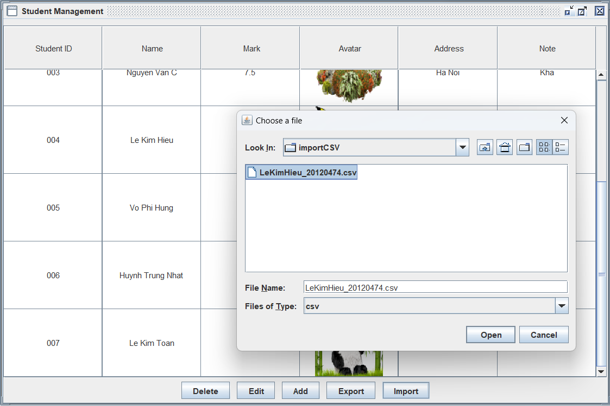

#Student Management System
##Author
**_FB: [Le Kim Hieu - 20120474](https://www.facebook.com/hopwj/)_**

## Description

This is a student management system that allows you to add, edit, delete, view students and export them to a csv file.

## Structure

- **`bin`** contains binary file `Input.bin` to `Read` or `Write` when program run.
- **`lib/exportCSV`** contains the code for exporting to a csv file.
- **`lib/Img`** contains the student Avatars used in the program. When you add a student, you can choose one image and it will create a new image with the name format `StudentID.jpg`.
- **`src`** contains the source code for the program.
  - **`controller`** contains the code for controller package.
  - **`model`** contains the code for Student model package.
  - **`renderer`** contains the code for the renderer. It converts path into a Image.
  - **`App.java`** contains the main method.

## How to run

- Double click on the file `Student-Manager.jar` to run the program.

## Featuress

- Add a student:
  - Click on the **`Add`** button in main screen.
  - Fill in the information of the Student (exception: ID must be unique, **`mark`** and **`note`** can be empty ).
- Edit a student:
  - Click on the **`Edit`** button in main screen.
  - Select the student you want to edit by entering the **`ID`** of Student.
  - Change the information you want.
- Delete a student:
  - Click on the **`Delete`** button in main screen.
  - Select the student you want to delete by entering the **`ID`** of Student.
- Export to a csv file:
  - Click on the **`Export`** button in main screen.
  - Select the folder you want to export to.
  - Enter the name of the file **`CSV`**.
  - Click on the **`Export`** button.
- Import from a csv file:
  - Click on the **`Import`** button in main screen.
  - Select the file you want to import.
  - Click on the **`Import`** button.
- Sort by ID or Mark:
  - Click on the _Header table_ **`ID`** or **`Mark`** in Table.

## Screenshots

### Main Screen

### Add Screen

### Edit Screen

### Delete Screen

### Export Screen

### Import Screen

### Sort Screen:

#### Sort by ID

#### Sort by Mark

## Thank you for reading!
